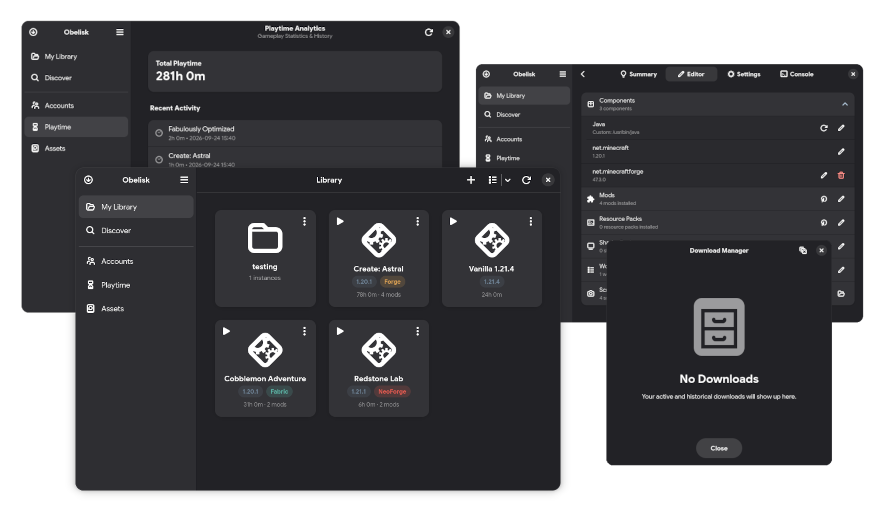

<div align="center">
  

  # Obelisk Launcher

  <p><strong>An elegant, feature-complete Minecraft launcher built natively for the GNOME desktop.</strong></p>
  <p>Engineered with Rust, GTK4, Libadwaita, and Relm4 &mdash; adhering strictly to GNOME Human Interface Guidelines.</p>

  <div>
    <a href="https://www.rust-lang.org/"></a>
    <a href="https://gtk.org/"></a>
    <a href="https://relm4.org/"></a>
    <a href="https://flatpak.org/"></a>
    <a href="INSTALL.md"></a>
  </div>

  <br>

  <div>
    <h3>
      <a href="INSTALL.md">Installation Guide</a>
      <span> &bull; </span>
      <a href="docs/SCREENSHOTS.md">Screenshots Gallery</a>
      <span> &bull; </span>
      <a href="#features">Features</a>
      <span> &bull; </span>
      <a href="https://github.com/Magnotec1/obelisk-launcher/issues">Report Issue</a>
    </h3>
  </div>

  <br>

  <a href="docs/SCREENSHOTS.md">
    
  </a>
  <p><em>Click the preview above to view the full <a href="docs/SCREENSHOTS.md">Screenshots Gallery</a>.</em></p>
</div>

<br>

> [!CAUTION]
> Made while assisted by AI for repetitive tasks.. I know this is a dealbreaker for a lot of people.

> [!WARNING]
> In active development, so expect the possibility of data loss. Always keep backups of critical saves.

---

## Overview

**Obelisk Launcher** is a modern Minecraft launcher crafted specifically for the Linux and GNOME desktop ecosystem. Obelisk combines modern Adwaita aesthetics with uncompromising power, offering full compatibility with the instance formats popularized by Prism Launcher, MultiMC, and PolyMC.

Whether you are managing complex Fabric/Forge modpacks, managing isolated Java runtimes, or reviewing detailed playtime statistics, Obelisk provides a cohesive, responsive experience that feels right at home on Linux.

---

## Features

### 🎮 Instance & Modpack Management
- **Universal Compatibility**: Uses standard MultiMC/Prism instance structures (`mmc-pack.json`), making migrations effortless.
- **Folder Grouping**: Organize instances into custom folders with multiple view modes (grid and compact list).
- **Mod Loaders**: Automatic setup and configuration for Fabric, Forge, NeoForge, and Quilt.
- **Drag-and-Drop Installation**: Drop downloaded `.jar` or `.zip` files directly into the Instance Editor to install mods, resource packs, shaders, and worlds.

### 🌐 Integrated Modrinth Discovery
- **Native Browser**: Search, filter, and install mods, modpacks, resource packs, and shaders directly inside the launcher via [Modrinth](https://modrinth.com/).
- **Dependency Resolution**: Automatically resolves required libraries and dependencies during installation.
- **Version Switching**: Switch mod versions, inspect changelogs, and view gallery screenshots without opening a web browser.

### ⏱️ Persistent Playtime Analytics
- **Granular Tracking**: Tracks playtime per instance as well as overall launcher statistics.
- **Session History**: Detailed logs of gameplay sessions with timestamps and durations.
- **Permanent Records**: Playtime history persists safely even if an instance is moved or deleted.

### 👤 Profile & Authentication
- **Microsoft Authentication**: Official OAuth authentication flow with custom Azure Client ID support.
- **Multi-Account Manager**: Seamlessly add and switch between multiple Microsoft profiles and local offline accounts.
- **Avatar Caching**: Local two-tier caching with average color extraction for instant, smooth UI rendering.

### ☕ Java & Asset Management
- **Automated Java Installer**: Automatically downloads, extracts, and configures isolated Java runtimes (Java 8, 17, 21, and 25).
- **System Detection**: Scans and detects host Java installations.
- **Storage Analytics**: Inspect disk usage across instances and Minecraft shared assets, with one-click cleanup to free space.

### 📤 Instance Sharing
- **Instant Code & File Sharing**: Export and share customized instance configurations with friends using shareable codes or archives.

### 📱 Adaptive & Responsive Design
- **Libadwaita Native**: Adapts dynamically between desktop monitors, half-tiled windows, and narrow/handheld displays (such as the Steam Deck) with collapsible drawer navigation.
- **Dark & Light Mode**: Seamlessly follows system-wide GNOME appearance preferences.

---

## Tech Stack & Architecture

- **Language**: [Rust](https://www.rust-lang.org/) (2021 Edition) &mdash; fast, memory-safe backend and UI logic.
- **GUI Toolkit**: [GTK4](https://gtk.org/) & [Libadwaita](https://gnome.pages.gitlab.gnome.org/libadwaita/) &mdash; GNOME desktop design language and widgets.
- **UI Framework**: [Relm4](https://relm4.org/) &mdash; Elm-inspired idiomatic reactive UI architecture for GTK4.
- **Async Runtime**: [Tokio](https://tokio.rs/) & [Reqwest](https://docs.rs/reqwest) &mdash; non-blocking background downloads and network requests.
- **Packaging**: [Flatpak](https://flatpak.org/) targeting the GNOME 50 Platform runtime.

---

## Installation & Getting Started

### Flatpak (Recommended)
Obelisk runs inside an isolated Flatpak sandbox with GNOME 50 Platform libraries:

```bash
# 1. Install prerequisites and GNOME 50 runtime
flatpak install flathub org.gnome.Platform//50 org.gnome.Sdk//50 org.freedesktop.Sdk.Extension.rust-stable//24.08

# 2. Build and install to user environment
flatpak-builder --user --install --force-clean build-dir flatpak/com.magnotec.obelisk.yaml

# 3. Launch Obelisk
flatpak run com.magnotec.obelisk
```

### Native Build (Cargo)
For local development and testing:

```bash
# Install development dependencies (Debian/Ubuntu/Mint)
sudo apt install build-essential pkg-config libssl-dev libgtk-4-dev libadwaita-1-dev unzip tar

# Build and run
cargo run --release
```

> [!TIP]
> For instructions on Fedora, Arch Linux, offline Flatpak bundle creation, and runtime dependencies, see the complete [Installation Guide (INSTALL.md)](INSTALL.md).

---

## Screenshots

Explore more screenshots of the library, instance editor, modrinth browser, and setup wizard in the **[Screenshots Gallery](docs/SCREENSHOTS.md)**.

<div align="center">
  <p>
    <a href="docs/SCREENSHOTS.md#library--instance-grid">Library View</a> &bull;
    <a href="docs/SCREENSHOTS.md#instance-editor">Instance Editor</a> &bull;
    <a href="docs/SCREENSHOTS.md#modrinth-browser">Modrinth Browser</a> &bull;
    <a href="docs/SCREENSHOTS.md#playtime-analytics">Playtime Analytics</a> &bull;
    <a href="docs/SCREENSHOTS.md#settings--java-management">Settings</a> &bull;
    <a href="docs/SCREENSHOTS.md#adaptive--compact-layout">Adaptive View</a>
  </p>
</div>
