# Screenshots

  

  
Screenshots of the current interface

  

    <a href="../README.md">Back to README</a> &bull;
    <a href="../INSTALL.md">Install Guide</a> &bull;
    <a href="https://github.com/Magnotec1/obelisk-launcher/issues">Issues</a>
  

## Contents
- [Library](#library)
- [Instance Editor](#instance-editor)
- [Modrinth Browser](#modrinth-browser)
- [Playtime Analytics](#playtime-analytics)
- [Account Management](#account-management)
- [Settings](#settings)
- [Download Queue](#download-queue)
- [Setup Wizard](#setup-wizard)
- [Compact Layout](#compact-layout)

## Library

Main view showing instances in grid layout

  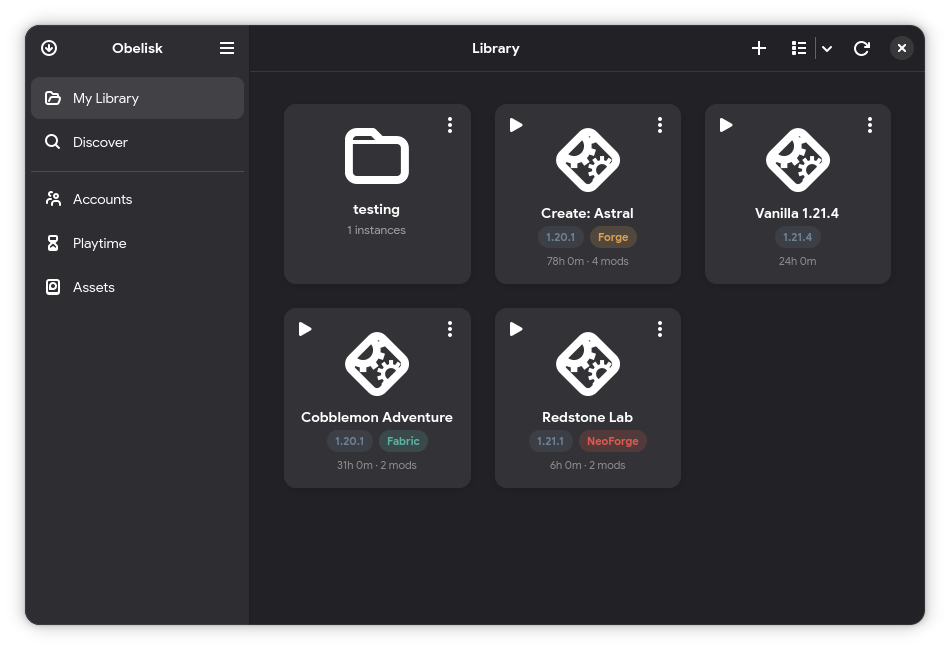

## Instance Editor

  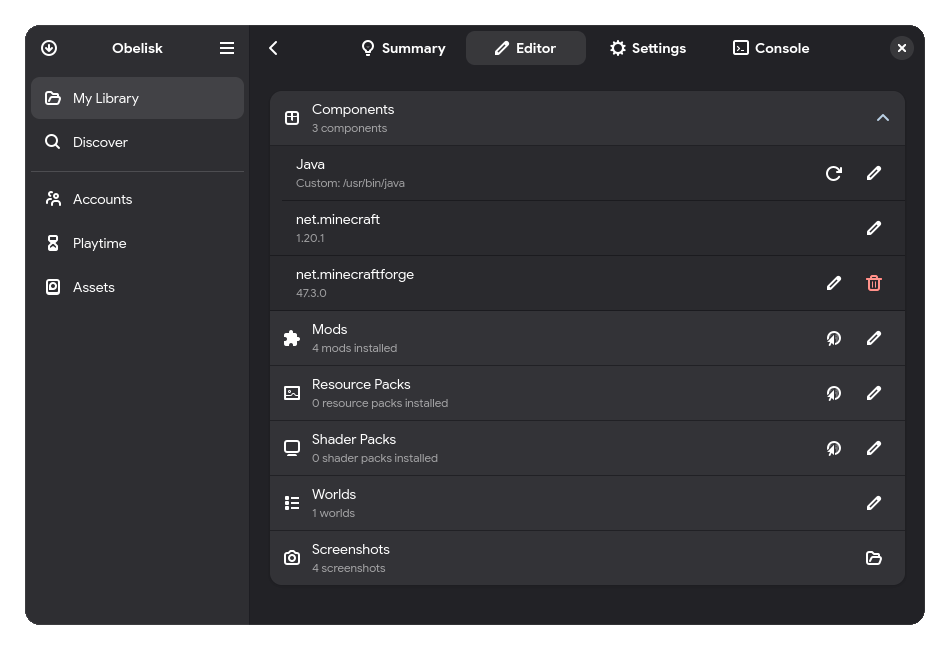

## Modrinth Browser

  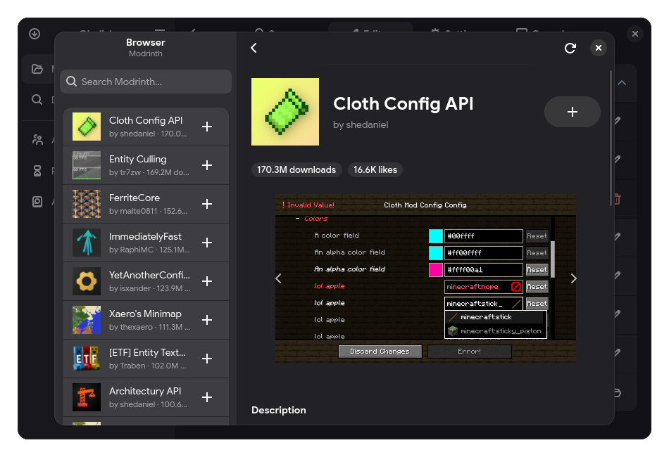

## Playtime Analytics

  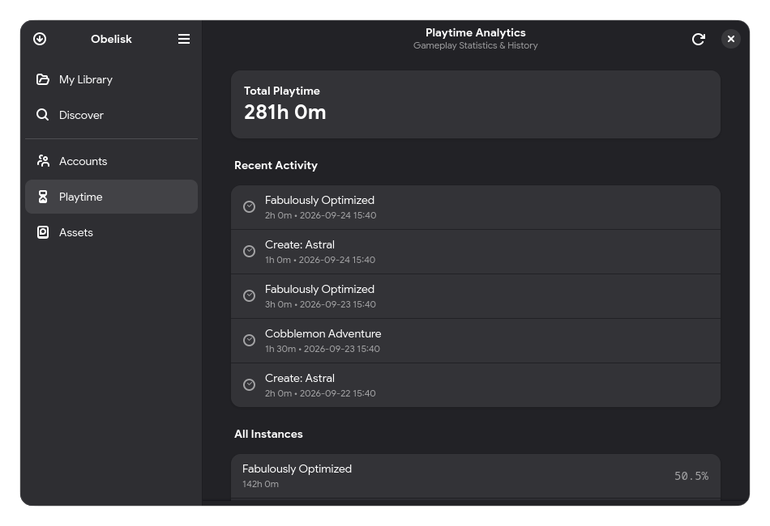

## Account Management

  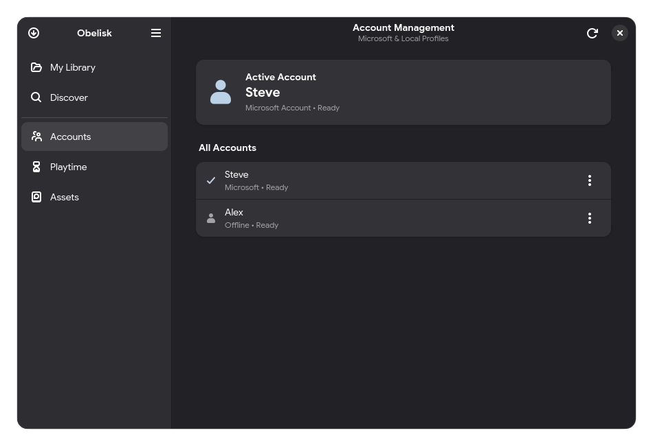

## Settings

  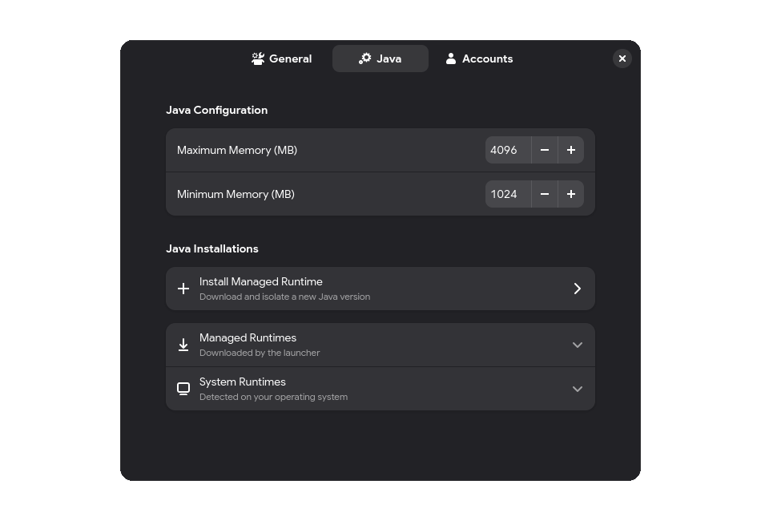

## Download Queue

  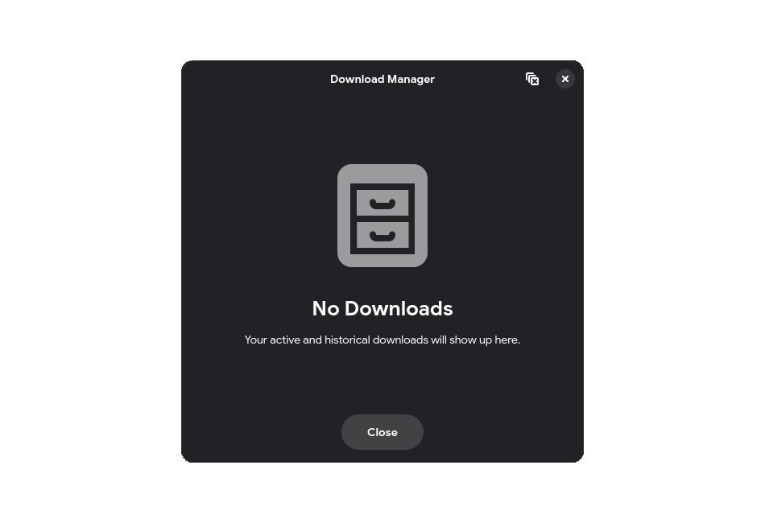

## Setup Wizard

  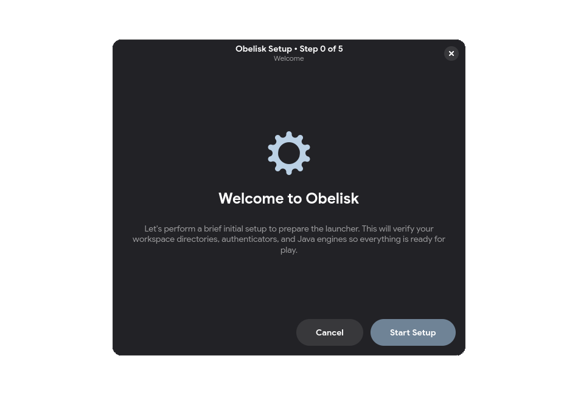

  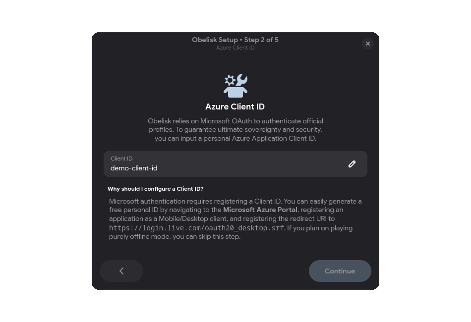

  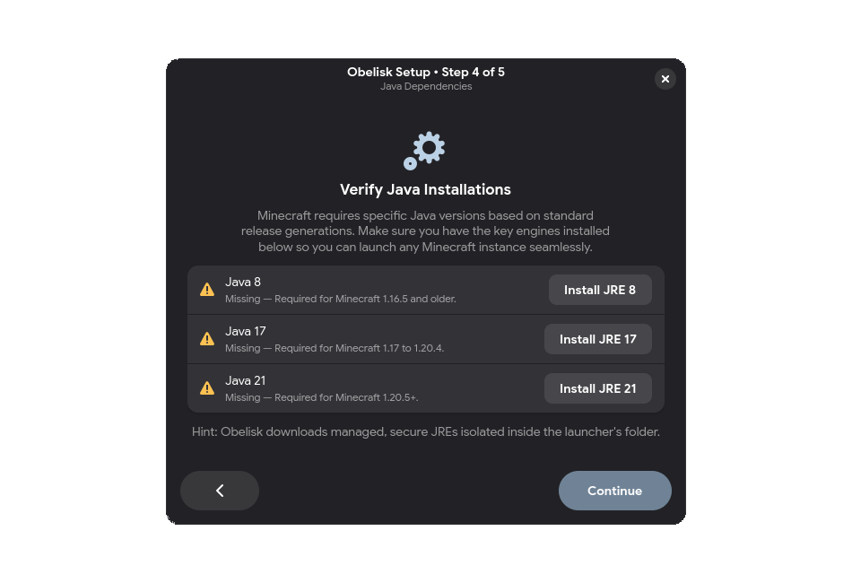

  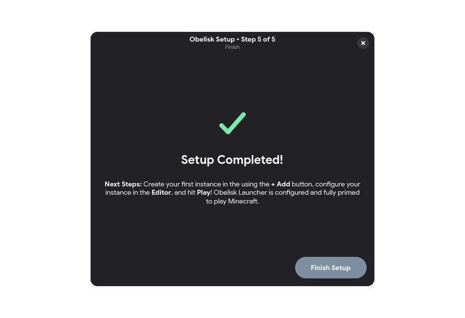

## Compact Layout

  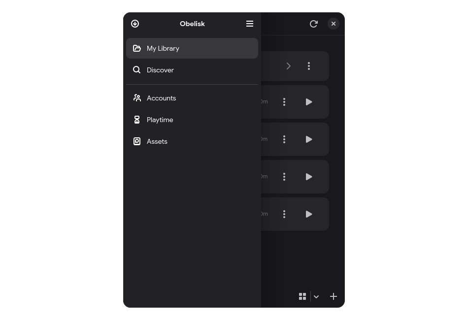

